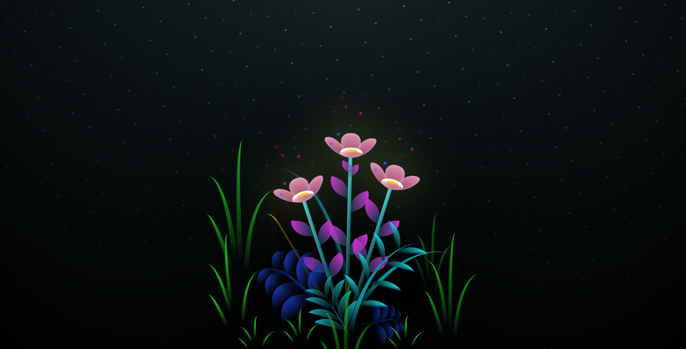

# Glowing Flower Animation


This project showcases a mesmerizing glowing flower animation using HTML and CSS. The animation creates a visually appealing scene with flowers, petals, and glowing effects. This project is perfect for learning about CSS animations and transformations.

## Table of Contents

- [Introduction](#introduction)
- [Features](#features)
- [Demo](#demo)
- [Installation](#installation)
- [Usage](#usage)
- [Customization](#customization)
- [Contributing](#contributing)
- [License](#license)

## Introduction

The Glowing Flower Animation project is a creative way to explore CSS animations. This project involves creating a night scene with beautifully animated flowers that glow and pulse. The animation is fully customizable, making it a great learning resource for anyone interested in web design and front-end development.

## Features

- **Unique Animations**: Each flower and its petals have unique animations that create a blooming effect.
- **Customizable Colors**: The colors of the petals, stems, and glowing effects can be easily customized.
- **Responsive Design**: The animation adjusts well to different screen sizes.

## Demo

To see the animation in action, open the `Home.html` file in your web browser. You can also view a live demo on [GitHub Pages](https://dumpsterdj.github.io/your-repository-name).



## Installation

To set up this project locally, follow these steps:

1. **Clone the Repository**:
   ```bash
   git clone https://github.com/dumpsterdj/glowing-flower-animation.git
   ```

2. **Navigate to the Project Directory**:
   ```bash
   cd glowing-flower-animation
   ```

3. **Open the HTML File**:
   Open `Home.html` in your web browser to view the animation.

## Usage

After cloning the repository and opening the `Home.html` file, you can enjoy the animated flowers. Feel free to edit the HTML and CSS files to customize the animation:

- **HTML**: Modify the structure in `Home.html` to add or remove flowers and other elements.
- **CSS**: Change the styles in `home.css` to customize colors, sizes, and animations.

## Customization

The project is designed to be easily customizable:

1. **Colors**: Modify the CSS variables in the `home.css` file to change the colors of petals, stems, and glowing effects.
   ```css
   .petal {
       background-color: #ff5733; /* Change this to your desired color */
   }
   ```

2. **Animations**: Adjust the animation properties like duration, timing functions, and keyframes to create different effects.
   ```css
   @keyframes bloom {
       from { transform: scale(1); }
       to { transform: scale(1.1); }
   }
   ```

3. **Additional Elements**: Add more elements such as leaves, grass, or background effects by extending the HTML and CSS files.

## Contributing

Contributions are welcome! If you have ideas to improve the project or find bugs, please open an issue or submit a pull request. Here’s how you can contribute:

1. **Fork the Repository**: Click the "Fork" button at the top of this page.
2. **Create a Feature Branch**: 
   ```bash
   git checkout -b feature/new-feature
   ```
3. **Commit Your Changes**: 
   ```bash
   git commit -m 'Add some new feature'
   ```
4. **Push to the Branch**: 
   ```bash
   git push origin feature/new-feature
   ```
5. **Open a Pull Request**: Navigate to your fork on GitHub and click the "New Pull Request" button.

## License

This project is licensed under the MIT License. See the [LICENSE](LICENSE) file for more details.


# Will You Be My Valentine? 💌

This project is designed to be an interactive webpage to ask someone to be your Valentine. Please use this code as inspiration and avoid simply copying it without understanding or giving credit.

---
## **🚀 Respect Open-Source**
I built this for **fun & learning**. If you fork or modify it:  
✔ **Use it for creativity, personal projects, or learning**  
✔ **Give proper credit when using it in public**  
✔ **Respect the original creator’s work**  
❌ **DO NOT try to profit from free content**  

 **If I find people selling this project, I will take action to prevent unauthorized use.**  


## How It Works 

This project consists of a simple webpage with a "Yes" and "No" button. When the user clicks the "No" button, the button text changes to a series of  messages, and the "Yes" button grows larger. If the user clicks the "Yes" button, they are redirected to a new page (`yes_page.html`).

### Features:
- **Interactive Buttons**: The "No" button cycles through , while the "Yes" button grows in size.
- **Responsive Design**: The webpage is designed to work on all screen sizes.

---

## How to Use 

1. **Download the Files**:
   - Clone this repository or download the `index.html`, `styles.css`,`yes_style.css`,`yes_page.html` and `script.js` files.

2. **Open the Project**:
   - Open the `index.html` file in your web browser.


---

## A Note on Code Usage 

While I am happy to share this project, I encourage you to use it as inspiration.
If you use this code as a base for your own project, please give credit where it's due. A simple shoutout or link back to this repository is appreciated!


---

## Code Overview 

### Files:

- `index.html`: The main HTML file that structures the webpage.
- `styles.css`: The CSS file that styles the webpage.
- `script.js`: The JavaScript file that handles the button interactions.
- `yes_page.html`: The yes page that sturctures the webpage.
- `yes_style.css`: The css file that styles the yes webpage.


### Key Functions:

- `handleNoClick()`: Changes the "No" button text and increases the size of the "Yes" button.
- `handleYesClick()`: Redirects the user to `yes_page.html`.

---

## License 📄

This project is licensed under the MIT License - see the [LICENSE](LICENSE) file for details.

---

Enjoy 💖
